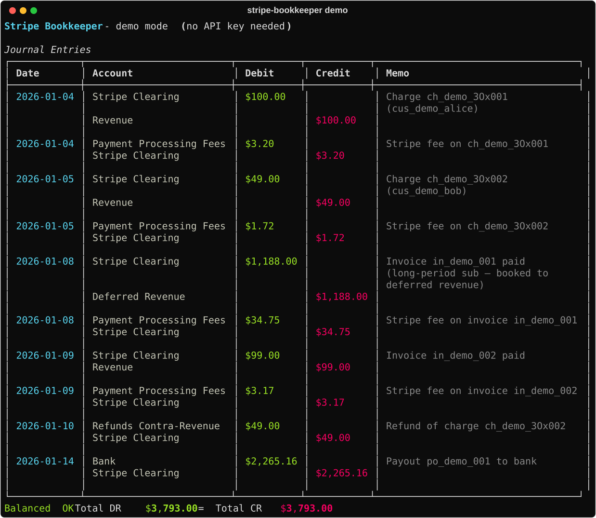

# stripe-bookkeeper

> **Stripe data isn't your books. This makes it your books.**

`stripe-bookkeeper` reads your Stripe activity and emits **GAAP-compliant double-entry journal entries** — the kind your CPA actually wants. No QuickBooks plugin, no $200/mo connector, no spreadsheet hell at tax time.



## Why this exists

Stripe gives you charges, payouts, and fees as separate API objects. Your accountant needs:

- **Double-entry**: every dollar shows up twice (one debit, one credit)
- **Stripe Clearing account**: the "money in transit" bucket between charge and payout
- **Fee accounting**: processing fees as an expense line, not netted into revenue
- **Deferred revenue**: annual subscriptions recognized monthly, not booked up-front
- **Reconciliation**: payouts that hit bank tie back to the underlying charges

Pulling this out of Stripe by hand is the kind of work that gets billed at $250/hr. `stripe-bookkeeper` does it in 30 seconds.

## Quickstart

```bash
pip install stripe-bookkeeper

# Offline demo — no API key needed
stripe-bookkeeper demo

# Real run — needs $STRIPE_API_KEY in env
export STRIPE_API_KEY=sk_live_...
stripe-bookkeeper sync --since 2026-01-01 --until 2026-03-31 --iif journal.iif

# Then in QuickBooks Desktop: File → Utilities → Import → IIF Files → journal.iif
```

The output CSV imports cleanly into QuickBooks, Xero, Wave, or whatever spreadsheet your CPA lives in.

## What it handles

| Stripe event | Journal entries produced |
|---|---|
| `charge.succeeded` | DR Stripe Clearing, CR Revenue + DR Fees, CR Stripe Clearing |
| `charge.refunded` | DR Refunds Contra-Revenue, CR Stripe Clearing |
| `invoice.paid` (subscription) | DR Stripe Clearing, CR Deferred Revenue (recognition booked monthly) |
| `payout.paid` | DR Bank, CR Stripe Clearing |
| `charge.dispute.funds_withdrawn` | DR Disputes Pending, CR Stripe Clearing |

Multi-currency, tax line splits, and dispute resolution write-backs are on the roadmap.

## Chart of Accounts

Default chart follows US GAAP for SaaS. Override with your own YAML:

```yaml
# my-coa.yaml
revenue: "4000 - SaaS Revenue"
deferred_revenue: "2400 - Deferred Revenue"
stripe_clearing: "1210 - Stripe Clearing"
payment_processing_fees: "6300 - Payment Processing Fees"
bank: "1000 - Operating Account"
refunds_contra: "4900 - Refunds & Returns"
```

```bash
stripe-bookkeeper sync --since 2026-01-01 --coa my-coa.yaml --csv journal.csv
```

## Output formats

- **QuickBooks IIF** — `--iif journal.iif` — import directly via QuickBooks Desktop → File → Utilities → Import → IIF Files. Each entry becomes a balanced General Journal transaction. ([sample output](examples/demo-output.iif))
- **CSV** — `--csv journal.csv` — works with every accounting tool, Xero, Wave, spreadsheets
- **JSON** — `--json journal.json` — for pipelines
- **Pretty table** — default stdout, useful for sanity-checking

```bash
stripe-bookkeeper demo --iif demo.iif --csv demo.csv --json demo.json
```

Xero direct upload, NetSuite, and Sage are on the roadmap.

## Status

v0.1 — handles the five most common Stripe event types covering ~95% of standard SaaS volume. Not yet audit-grade for businesses with complex tax, multi-entity consolidation, or non-USD operations. Output is CSV/JSON you can review before booking.

If you're a CPA or controller and something here is wrong, [open an issue](../../issues). The rules engine is one file ([`rules.py`](stripe_bookkeeper/rules.py)) and PRs are welcome.

## License

MIT.

---

Built by [@Ankitajainkuniya](https://github.com/Ankitajainkuniya) — ex-founder ($5M ARR, acquired). I needed this for my own books and there wasn't a free version.
